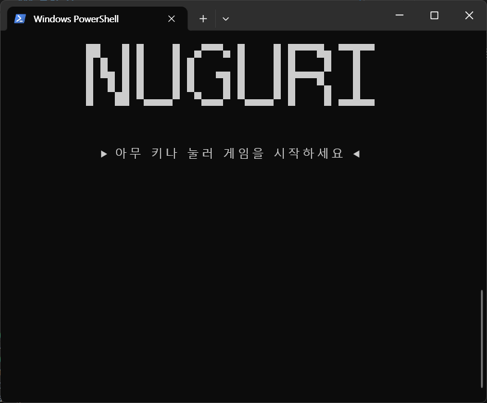
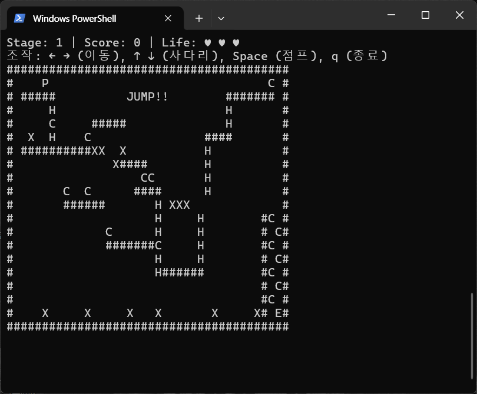
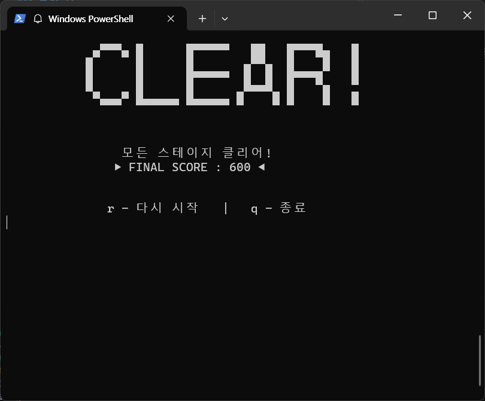
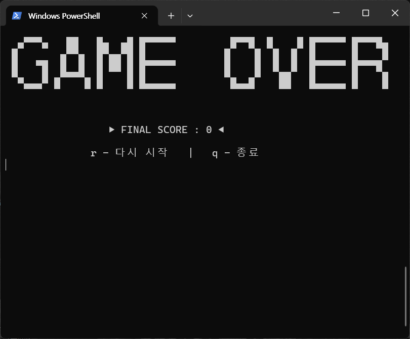

# 13조 너구리게임
---

## Repository 주소: https://github.com/khw04/DataStruct_Nuguri_team13


## 학번 / 이름
| 학번     | 이름          | 비고    |
|----------|---------------|---------|
| 20233088 | 권희원        | 조장    |
| 20223097 | 김치헌        |         |
| 20223133 | 잔후 미셸     |         |
| 20243131 | 정혜영        |         |
---

## OS별 컴파일 및 실행 방법 가이드

### (1) windows 환경

#### cmd:
    gcc -o nuguri.exe nuguri.c
    nuguri.exe
#### PowerShell: 
    gcc -o nuguri.exe nuguri.c
    ./nuguri.exe
---

### (2) Linux 환경
    gcc -o nuguri nuguri.c
    ./nuguri
---

### (3) macOS 환경
    gcc -o nuguri nuguri.c
    ./nuguri 
---

## 구현 기능 리스트 및 게임 스크린샷

### 구현기능 리스트
1. 리스폰, 생명력 시스템 구현
2. 키 입력처리 개선 & Crossplatform 지원
3. 시작 & 엔딩 & 게임오버 화면 구현
4. 점프, 충돌 등등 특정 상황에 시스템 비프음 구현
5. 점프 로직 개선
6. 사다리 로직 개선
7. 기존의 문제있던 맵을 버리고 새로운 맵을 만듬
---

### 스크린샷
|**게임 시작**|**게임 플레이**|
|:-:|:-:|
|||
|**게임 클리어**|**게임 오버**|
|||
---

## 개발 중 발생한 OS 호환성 문제와 해결 과정 기술

### 1.플랫폼별 헤더 분기 처리
운영체제마다 사용하는 헤더가 다르기 때문에 다음과 같이 분기 처리를 적용하였다.

- **Windows**
  - `<windows.h>`: Sleep(), 콘솔 모드 설정 등 Windows API 사용  
  - `<conio.h>`: _kbhit(), _getch() 등 콘솔 입력 함수 제공
- **Linux / macOS**
  - `<unistd.h>`: usleep(), read() 등 POSIX API 지원  
  - `<termios.h>`: 터미널 모드 설정(Raw 모드 구현)  
  - `<fcntl.h>`: 논블로킹 입력 감지 구현

공통적으로 필요한 `<stdio.h>`, `<stdlib.h>`, `<string.h>`, `<time.h>`는 모든 플랫폼에 포함하였다.

---
### 2. usleep() 대응 매크로 정의
Windows는 POSIX 함수인 `usleep()`을 직접 지원하지 않는다.  
기존 POSIX 코드를 최대한 수정하지 않기 위해 다음과 같이 매크로로 대응하였다.

```c
#define usleep(x) Sleep((x) / 1000)
```
이로써 Windows에서도 기존 코드를 변경하지 않고 동일한 대기 기능을 사용할 수 있게 하였다.

---
### 3. delay() 함수 설계
대기 시간을 **밀리초 단위(ms)** 기반으로 통일하기 위해 OS별 다른 함수를 래핑한 delay()를 구현했다.

- Windows: `Sleep(ms)`
- Unix(POSIX): `usleep(ms * 1000)`

이로써 게임 내부에서 동일한 인터페이스로 시간 지연 기능을 호출할 수 있게 되었다.

---
### 4. Raw 입력 모드 설정 (enable_raw_mode / disable_raw_mode)
Linux/macOS 환경에서는 즉시 입력(Non-buffered input)을 위해 터미널을 Raw 모드로 설정해야 한다.

- Unix: termios를 이용해 canonical 모드와 echo를 비활성화  
- Windows: 콘솔 입력이 원래 즉시 입력을 지원하므로 빈 함수로 처리

---
### 5. kbhit() 기능의 플랫폼 통합
Windows는 `_kbhit()`을 그대로 사용할 수 있지만, Unix에는 동일한 기능이 없다.  
따라서 Unix에서는 다음 방식으로 직접 구현하였다.

- termios로 즉시 입력 모드 유지  
- fcntl로 stdin을 논블로킹 모드로 설정  
- read()로 입력 여부만 확인

이를 통해 두 플랫폼 모두 동일한 kbhit() 기능을 사용할 수 있게 되었다.

---
### 6. cross_getch() 구현 (방향키 입력 통합)
Windows에서는 방향키 입력이 0 또는 224 prefix를 포함한 2바이트로 들어온다.  
Unix에서는 escape sequence 형태로 입력된다(`\033[A` 등).

이를 통일하기 위해:

- Windows: prefix 검사 → w, a, s, d로 변환  
- Unix: escape sequence를 파싱하여 동일하게 변환

결과적으로 플랫폼에 상관없이 동일한 WASD 입력 UX를 제공할 수 있었다.

---
### 7. ANSI 이스케이프 활성화 (enable_ansi)
 Windows 10 이상에서만 ANSI 이스케이프 시퀀스를 지원하고, CMD,PowerShell에서는 기본적으로 비활성화 해놓기 때문에

이를 해결하기 위해 다음 플래그를 활성화하였다.

```c
ENABLE_VIRTUAL_TERMINAL_PROCESSING
```
이로 인해 Windows에서도 커서 이동 코드 등 ANSI 기능을 사용할 수 있게 되었다.

---
### 8. 화면 지우기(clrscr) 개선 및 깜빡임 해결
Windows CMD의 전체 화면 지우기는 화면 깜빡임이 심하다.

그래서 OS별로 다음과 같이 처리하였다.

- Windows: 전체 지우기 대신 커서를 (0,0)으로만 이동  
- Unix: ANSI 코드로 전체 화면 삭제 후 커서 이동

이 방식으로 화면 깜빡임이 크게 개선되었다.

---
### 9. gotoxy(), hide_cursor(), show_cursor() 기능 
ANSI 시퀀스를 이용했다.

- 커서 이동: `\033[y;xH`  
- 커서 숨김: `\033[?25l`  
- 커서 표시: `\033[?25h`

전체 화면을 지우지 않고 필요한 부분만 업데이트해 화면 잔상 문제 & 커서가 이리저리 움직이는 문제도 해결하였다.

---
### 10. draw_life() 잔상 문제 해결
전체 화면을 매 프레임 지우지 않으면 이전 하트(♥)가 화면에 남는 문제가 있었다.  
이를 해결하기 위해:

- 고정 위치로 커서를 이동  
- 남은 하트 + 공백을 포함한 문자열을 매번 덮어쓰기

이 방식으로 HP 표시가 정확하게 갱신되도록 수정했다.

---
### 11. ENABLE_VIRTUAL_TERMINAL_PROCESSING 매크로 정의
오래된 Windows SDK나 MinGW 환경에서는 해당 매크로가 정의되지 않은 경우가 있어  
다음과 같이 안전하게 직접 정의하였다.

```c
#ifndef ENABLE_VIRTUAL_TERMINAL_PROCESSING
#define ENABLE_VIRTUAL_TERMINAL_PROCESSING 0x0004
#endif
```

---
### 12. Windows UTF-8 출력 문제 해결 (chcp 65001)
Windows CMD/Powershell은 기본적으로 UTF-8 인코딩을 사용하지 않아 한글 출력이 깨지는 문제가 있었다.

이를 해결하기 위해 프로그램 시작 시 다음 명령을 실행하였다.

```c
system("chcp 65001 > nul");
```

이를 통해 Windows 콘솔에서도 한글 및 UTF-8 문자를 정상적으로 출력할 수 있었다.